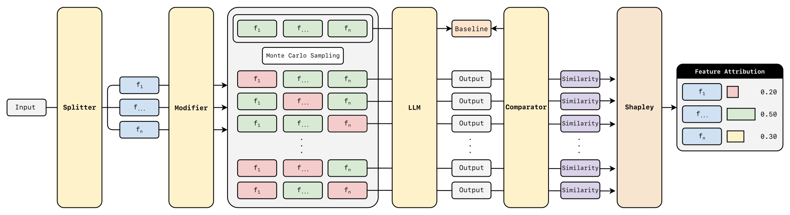

# How it Works

    

FeatureSHAP works by applying the principles of Shapley values to the features of a text prompt. The process is as follows:

1.  **Splitting**: The input prompt is divided into a set of features using a specified `Splitter`. Each feature is a segment of the original text, such as a word, a line, or a code block.

2.  **Coalition Generation**: To estimate the contribution of each feature, different subsets (coalitions) of features are created. For each feature, it generates coalitions with and without that feature.

3.  **Perturbation**: In coalitions where a feature is "absent," it can also not be simply removed. It can be replaced by a modified version generated by a `Modifier`. This could mean masking the features or replacing it with a placeholder.

4.  **Model Inference**: The language model generates text from each of the perturbed prompts.

5.  **Comparison**: The generated outputs are compared to a baseline output (usually the output from the original, unperturbed prompt) using a `Comparator`. The comparator measures the similarity or difference, providing a score that reflects the impact of the perturbations.

6.  **Shapley Value Calculation**: The Shapley value for each feature is calculated by averaging the marginal contribution of that feature across all the different coalitions. This value represents the feature's importance to the final output.

# Modules

### `FeatureSHAP`

This is the main class that orchestrates the entire process. It takes a model, a splitter, a modifier, and a comparator as input and provides the `analyze` and `analyze_batch` methods to compute Shapley values.

### Models

Models are the text generation models to be explained. The following models are supported:

*   `HuggingFaceModel`: A wrapper for models from the Hugging Face Hub.
*   `VLLMModel`: A wrapper for models compatible with the vLLM inference engine, allowing for faster generation.
*   `OpenAIModel`: A wrapper for models accessed through the OpenAI API.

### Splitters

Splitters are used to divide the input prompt into features. The choice of splitter determines the granularity of the analysis.

*   `WordSplitter`: Splits the prompt into individual words and punctuation.
*   `PointsSplitter`: Splits the prompt based on punctuation marks.
*   `LLMSplitter`: Uses a language model to intelligently segment the prompt.
*   `TokenizerSplitter`: Splits the prompt into tokens based on the model's tokenizer.
*   `BlocksSplitter`: Splits the prompt into larger blocks of text.

### Modifiers

Modifiers are used to create a "neutral" or "perturbed" version of a feature when it's considered "absent" from a coalition.

*   `MaskerModifier`: Replaces a feature with a special `|MASKED|` token.
*   `RemoverModifier`: Removes non-structural tokens from a feature, keeping only the syntactic scaffolding.
*   `RemovalModifier`: Completely removes a feature.
*   `LLMModifier`: Uses a language model to paraphrase or alter the feature.

### Comparators

Comparators are used to measure the difference between the model's output for a perturbed prompt and the baseline output.

*   `BLEUComparator`: Uses the BLEU score, common in machine translation, to measure similarity.
*   `CodeBLEUComparator`: A variant of BLEU specialized for source code.
*   `BertScoreComparator`: Uses contextual embeddings from BERT to compare the semantic similarity of the outputs.
*   `HuggingFaceComparator`: A flexible comparator that can use any Hugging Face model to compute sentence similarity.
*   `OpenAIComparator`: Uses an OpenAI model to determine the similarity between two pieces of text.
*   `TfidfTextComparator`: A classical NLP approach using TF-IDF vectors to measure text similarity.
